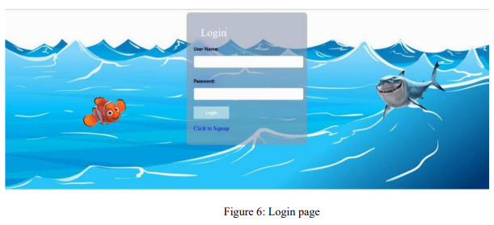

# HelpNemo

Game Description:

In this project , contains an interactive game the characters of fish  in figure-1 and shark in figure-2,
the idea of the game is that the fish  in figure-1 swims and when you see the shark in figure-2 jump over it and does not get hit by it,
and if you hit it here the player has lost , and window display written (game over) the fish in figure-1 is moved through the spacebar button on the keyboard,
The fish in figure-1 jumps over the shark in figure-2, As for the target audience , the field is open for young people and adults to play it.
In this figure-3, it shows the main page of the player on the far left, the player is welcomed and his name appears. After the game is finished, 
his score appears automatically. After that, the player presses the save button, and it is saved in the database. 
On the far right, there is a logout if he wants to exit the game, and there is also a hyperlink "Show High Score". 
When the player clicked this hyperlink displays the highest scores of players in table shows in figure-4.

1. Flow Chart

2. Look & Feel 

At first, we put a sea background and a fish (Nemo) and a shark (Bruce) character through
this site [1], and we put a button to play again by returning through this site [2], and it was
coordinated in terms of color and location so that it is in the middle of the page from through
[3]. In this reference [4], it helped to shown players' scores from highest to lowest and put it
on a table, with User Name and Date that was login. In these two references [5] and [6], they
helped us implement the idea of calculating the score for players.

3. Dynamic Components 

We have one class called "index.php" that include dynamic script to calculate hits (scores)
and connect to three Java script classes: 
1- fish.js
2- shark.js
3- sketch.js 

4. Business Logic

At first, the player logs in to the game shown in Figure 6, and then his data is saved in the
database, which includes the user name, the password, and the date the player played. When
the game is finished, if the player presses save button, his score will be saved in the database.
Otherwise, no.
SQL queries: we used insert when the player signed up for the game to add the player's data to
the databases. Also, used select for the player's name when logging into the game. In addition,
the update was used to update the score for the player upon completion of the game in the
database, because, in the beginning, zero was recorded for the player.
The sign-up page, the login page, and the game page were built in HTML using Form for the
player enter his information. Also we built table to show the scores. as well as adding pictures
to the game. The game's connection to the databases was made using PHP, and SQL queries
were made to update, insert, and select.

5. Code document

References

1- https://toppng.com/finding-nemo-characters-png-imagenes-de-nemo-gif-PNG-free-PNGImages_274967
2- https://www.w3schools.com/css/css3_buttons.asp
3- https://css-tricks.com/quick-css-trick-how-to-center-an-object-exactly-in-the-center/
4- https://codingstatus.com/display-data-in-html-table-using-php-mysql/
5-https://www.youtube.com/watch?v=Yc1jG73dsTc&t=551s
6-https://youtu.be/WYufSGgaCZ8
